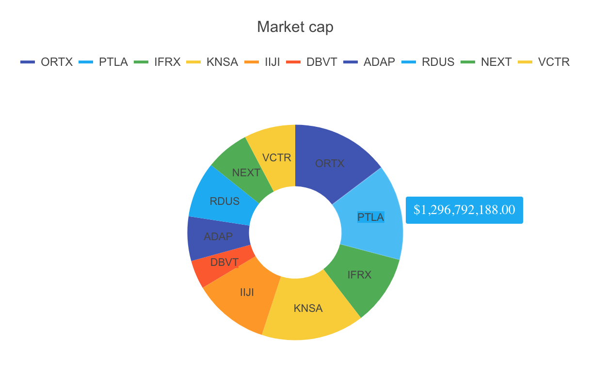

# Kendo UI Donut Chart for Vue

## Overview

A donut chart is similar to a pie chart except it has a whole in the middle of the circle. This demo shows the market cap of different stocks in relation to all of the stocks listed.


## Example



## Getting Started

See the following tutorial for instructions on basic usage:

[How to Use a Vue Pie and Donut Chart UI Component in Your Web App](https://www.telerik.com/blogs/how-to-use-a-vue-pie-and-donut-chart-ui-component-in-your-web-app)

## Build Setup

``` bash
# install dependencies
npm install

# serve with hot reload at localhost:8080
npm run dev

# build for production with minification
npm run build
```

## Related Links

- [Kendo UI Pie Chart for Vue](https://github.com/albertaw/kendoui-piechart)
- [Kendo UI Scatter Chart for Vue](https://github.com/albertaw/kendoui-scatterchart)
- [Kendo UI Bubble Chart for Vue](https://github.com/albertaw/kendoui-bubblechart)
- [Kendo UI Bar Chart for Vue](https://github.com/albertaw/kendoui-barchart)
- [Kendo UI Line Chart for Vue](https://github.com/albertaw/kendoui-linechart)
- [Kendo UI StockChart for Vue](https://github.com/albertaw/kendoui-stockchart)
- [Kendo UI Sparkline for Vue](https://github.com/albertaw/kendoui-sparkline)

